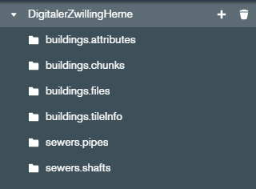

# Digital Twin Herne Backend <!-- omit in toc -->
A prototypical Implementation of a Digital Twin for the city of Herne in Germany.

**Table of Content**
- [Overview](#overview)
- [Dependencies](#dependencies)
- [Installation](#installation)
- [Data Location](#data-location)
- [Development Information](#development-information)
- [Contact](#contact)
- [License](#license)

## Overview
This repository contains the backend component of the [Digital Twin Herne Project](https://github.com/t16h05008/DT-Herne).

## Dependencies
This repository contains the source code without any real-world data. The backend component can startup without any data (as long as the database exists), but to be of any use you need to provide your own data. Note that (for now) the component and the API is tailored to the data used in cooperation with the city of Herne. Without adjustments to the api, the application is most likely not compatible with your own data out of the box. The types of data included are described in detail in section [Data Location](#data-location).

## Installation
This section describes how to install the application in an production environment. For development see [Development Information](#development-information) below.

1. Clone the repository to your local system.
2. Configuration is done in the file `.env`. The file in the repository is a dummy file (comments are added in documentation only):
    ```
    PORT: 8000                                  // The port where the application runs
    MONGODB_URI: "mongodb://localhost:27017"    // The uri to the mongodb database, that contains the data.
    DB_NAME: "DigitalTwin"                      // The name of the database in mongodb.
    PATH_TO_SENSOR_INFO: "./sensorInfo.json"    // The path to the file where sensors are listed and manged.
    ```
    Check if the values in the file match your setup, especially `MONGODB_URI` and `DB_NAME`.
3. From the project's root directory run the command `npm install`.
    This uses the [Node Package Manger](https://www.npmjs.com/) to install the application's dependencies.
4. The application should start up with the command `npm start` under the port specified in `.env`. If the mongodb can't be reached the startup process fails due to a timeout. The API documentation is available under `http://localhost:<PORT>/api-docs` after startup
5. Deploy the application to a webserver.

There is also a dockerfile available. However, building with docker is (so far) not as flexible as building from source and need to be revisited at a later point in time. Feel free to experiment with it, but right now the recommended way of installation is the one described above.

## Data Location

There are two data locations. Depending on the API endpoint / data type, data is stored either in a mongodb instance or in a subdirectory on the server itself. The mongodb instance is not part of this repository and has to be setup before the backend server. While the database name is variable, the collection names are still hardcoded. The database used for development looks like this:



The [Data Management sub-repository](https://github.com/t16h05008/DT-Herne-Data-Management) offers scripts and tools to create the shown collections. In most cases, these are tailored to the data provided by the city of Herne and might not work for your own data. But as long as the collections exist, the application will start, which is the first step.

For some endpoints, namely the pointcloud and the terrain tiles, data is stored in the subdirectory `data` (doesn't exist by default). There might be a way to store a folder-structure in mongodb, but for now the backend is partially used as a file-server. The pointcloud is expected to be in the subdirectory `/data/metroPc` and the terrain tiles in the subdirectories `data/terrain1`, `data/terrain10`, `data/terrain25` and `data/terrain50`, where 1, 10, 25, and 50 stand for the resolution (which is an api query parameter). Again, refer to the [Data Management sub-repository](https://github.com/t16h05008/DT-Herne-Data-Management) to see how these files are created.


## Development Information
For development it is not needed to deploy the application on a web server, since database, backend and frontend probably run on the same machine. Aside from that, the installation is the same as described above.

## Contact
See the section [Contributing Organizations and Contact](https://github.com/t16h05008/DT-Herne#contributing-organizations-and-contact) in the project's main repository.

## License
See the section [License](https://github.com/t16h05008/DT-Herne#license) in the project's main repository.